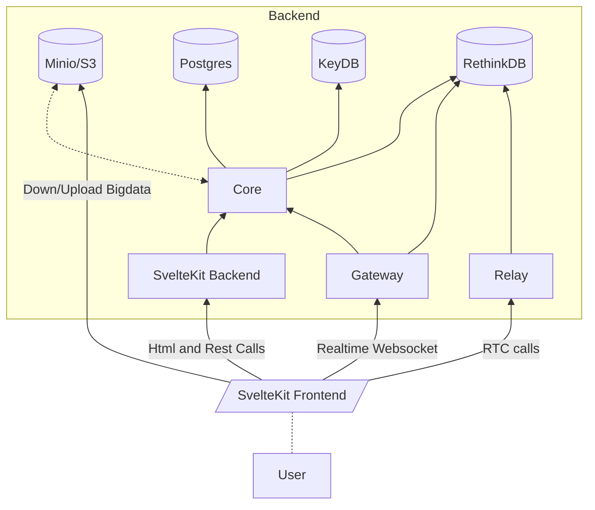

# Architecture

We use a microservice monolyth hybrid architecture.

```mermaid
flowchart BT
    subgraph Backend
        minio[(Minio/S3)]
        postgres[(Postgres)]
        keydb[(KeyDB)]
        rethinkdb[(RethinkDB)]
        core[Core]
        gateway[Gateway]
        relay[Relay]
        sveltekit_backend[SvelteKit Backend]
    %% Backend Connections
        core ---> postgres & keydb & rethinkdb
        sveltekit_backend --> core
        gateway --> core & rethinkdb
        relay ----> rethinkdb
        core <-.-> minio
    end

    svletekit_frontend[/SvelteKit Frontend/]
    svletekit_frontend -->|Html and Rest Calls| sveltekit_backend
    svletekit_frontend -->|Realtime Websocket| gateway
    svletekit_frontend -->|RTC calls| relay
    svletekit_frontend ----->|Down/Upload Bigdata| minio
    user[User]
    user .- svletekit_frontend
```
